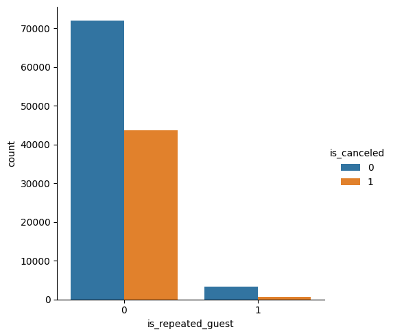
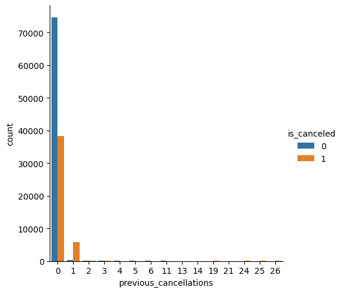
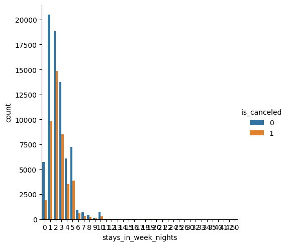
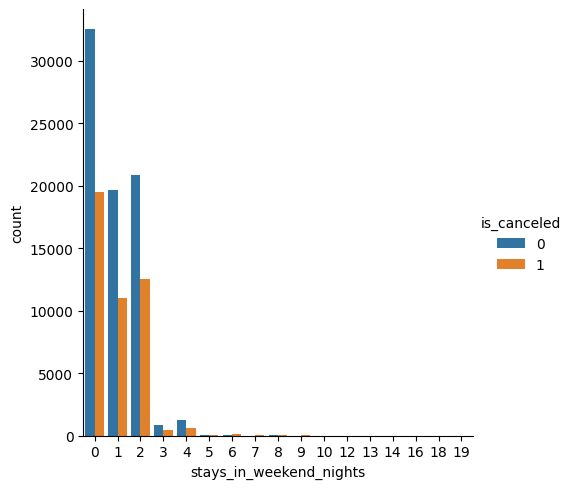
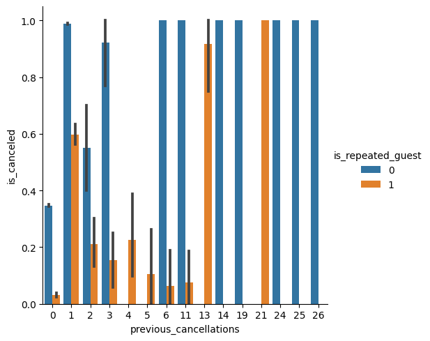
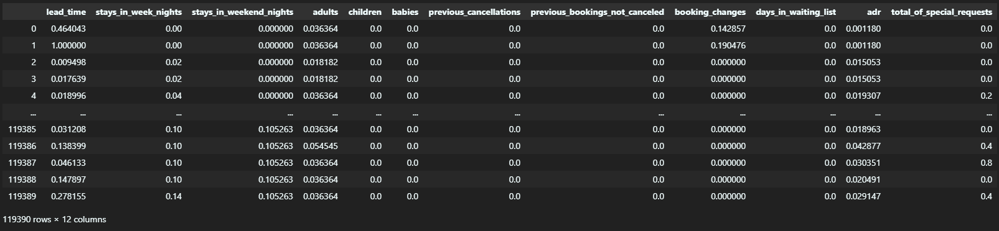
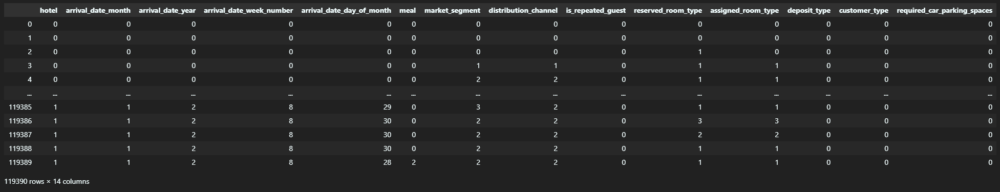
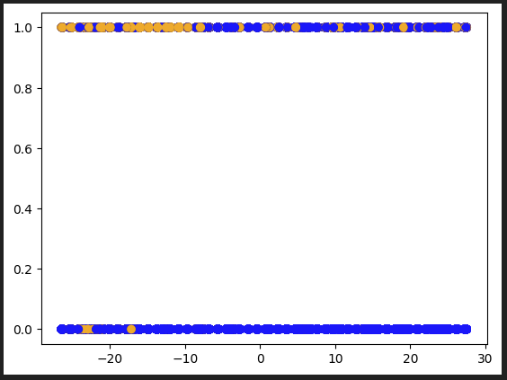
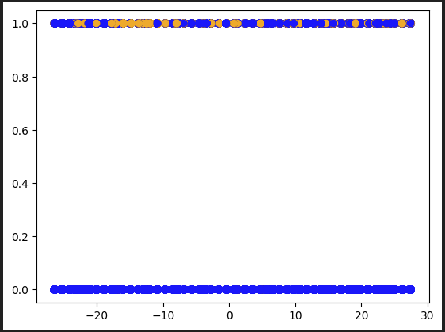
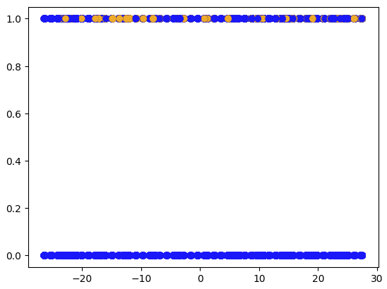

# Table of Contents
1) [Introdction](#introduction)
2) [Figures](#figures)
3) [Methods](#methods)
4) [Results](#results)
5) [Discussion](#discussion)
6) [Conclusion](#conclusion)
7) [CollaborationStatement](#collaboration-statement)
8) [PriorSubmissions](#prior-submissions)
9) [RelatedNotebooks](#related-notebooks)

## Introduction

Hello, and welcome to our research on hotel reservation cancellations. This project is done for our ECS 171 - Machine Learning class at UC Davis, instructed by Edwin Solares. Throughout our project, we demonstrate how we are able to accurately predict future hotel cancellations, utilizing recorded data of previous behaviors and various machine learning tools. This could possibly spark popularity amongst denying reservations to hotels, which is something popular companies like AirBNB utilizes.  Our results from the data holds significance as we are able positively impact hotels from all over the world by helping them save their time, energy, and resources on tourists and guests who are more likely to show up.

## Figures
The figures below show how varying attributes can have a profound effect on whether a hotel reservation will be cancelled.

### Figures One & Two
Figure 1 shows how being a repeated guest can have a massive impact on whether a hotel reservation is canceled as it is significantly more probable that a repeated guest will not cancel their reservation. Additionally, Figure 2 shows how previous behaviors have a strong correlation with future actions as it is remarkably more likely that a hotel reservation is canceled when it had already been canceled once in the past. 
#### Figure One

#### Figure Two


### Figures Three & Four
Figure 3 shows how the number of stays over weekend nights can affect a cancellation. Cancellations per weekend night is over half as likely to be canceled than not canceled for all nights. In contrast, Figure 4 shows how the number of stays over week nights can affect cancellations. Canelations per week night start off under half to be canceled than not canceled for 0 to 1. However, as days pass the likelihood of cancelation to no cancellation increases to over half as well. This suggests that there is more of a tendency to cancel reservations over the weekends and longer stays than shorter stays on weekdays. 
#### Figure Three

#### Figure Four


### Figure Five
Figure 5 surprisingly shows how in some cases it is actually more likely that a repeated guest cancels than a new guest. In this figure we can also see how data can use given data to relate other attributes with one another.
#### Figure Five


## Methods

This section will provide the different methods and means for how we were going to possibly predict hotel cancellations.

Links to the Following Sections and Where They Apply:
1) [Data Exploration](Assignments/Data%20Exploration%20Milestone/DataExploration.ipynb)
2) [Preprocessing, Data Splitting, Model One, Reporting Results](Assignments/Preprocessing%20&%20First%20Model/PreprocessingFirstModelMilestone.ipynb)
3) [Model Two, Reporting Results](Assignments/Second%20Model/Second%20Model.ipynb)

### Data Exploration

Our data exploration displayed our hotel reservations data in 3 separate cells. Our first cell contained information on our whole dataframe. Our second cell contained information on our attributes. Our third cell contained information on our class. These blocks exhibited details on our dataframes, including their shape, their total number of observations, a list of column names, and the data type in each column. 

```
#var = df or X or y
print("Shape:        ", var.shape)
print("Total Observations: ", var.shape[0] * var.shape[1])
cols = list(var.columns)
cols_dtype = {}
for i in range(0, len(cols)):
    cols_dtype[cols[i]] = df[cols[i]].dtype
print("var Column Desc:  ", cols_dtype)
```
Afterwards, we found columns containing missing data.
```
cols = list(var.columns)
for i in range(len(cols)):
    print("Missing Values (" + cols[i] + "): " + str( df[cols[i]].isna().sum() ))
```
Lastly, we used seaborn pairplots, histplots, and displots to visualize our data frequencies and distributions.
```
#For numerical values
sns.pairplot(data=df, y_vars=['is_canceled'], x_vars=['x', 'x', 'x', …])
sns.histplot(data=df, x='x', 'x', 'x', …, kde=True)
#For nomail values
sns.displot(df['x'].astype(str))
print(df['x'].value_counts())
```


### Preprocessing

First, we transformed our data, removing any unnecessary or duplicate columns. For example, there was a ‘reservation_status’ attribute that was essentially equivalent to our class. 
```
df = df.drop(columns=['country', 'agent', 'company', 'reservation_status_date', 'reservation_status'])
```
Second, we imputed our data to handle NaN/Null/None values.
```
df = df.replace(np.nan, 0)
```
Third, we used keras MinMaxScaler() to normalize our numerical data between values of 0 and 1. 
```
norm_scaler = MinMaxScaler()
df[numericalAttribs] = norm_scaler.fit_transform(df[numericalAttribs])
```
Fourth, we encoded our categorical columns to numerical values between 0 ~ N - 1 unique values. 
```
encodings = {}
for a in categoricalAttribs:
    keys = {}
    iter = 0
    for val in list(df[a].unique()):
        keys[val] = iter
        iter += 1
    encodings[a] = keys

df = df.replace(encodings)
```


### Data Splitting

Before building any models, we split the Train:Test data 70:30, then took [~‘is_canceled’] as our attributes(X) and [‘is_canceled’] as our class(y). 
```
Train, Test = train_test_split(df, test_size=0.3)
X_train = Train.drop('is_canceled', axis = 1)
X_test = Test.drop('is_canceled', axis = 1)
y_train = Train['is_canceled']
y_test = Test['is_canceled']
```


### Model One

Our first model used keras Sequential() and Dense() to build an artificial neural network(ANN) model. Our ANN had an input size of 26 and activation functions of ‘relu’, ‘softmax’, ‘softmax’, ‘tanh’, ‘tanh’, ‘tanh’, ‘sigmoid’ with unit sizes of 50, 35, 35, 20, 20, 10, and 1 respectively. 
```
model = Sequential() 
model.add(Dense(units = 50, activation = 'relu', input_dim = 26))
model.add(Dense(units = 35, activation = 'softmax'))
model.add(Dense(units = 35, activation = 'softmax'))
model.add(Dense(units = 20, activation = 'tanh'))
model.add(Dense(units = 20, activation = 'tanh'))
model.add(Dense(units = 10, activation = 'tanh'))
model.add(Dense(units = 1, activation = 'sigmoid'))
```
Afterwards, we compiled and trained our ANN for 100 epochs.
```
model.compile(optimizer = 'rmsprop', loss = 'binary_crossentropy')
model.fit(X.astype('float'), y, batch_size = 1, epochs = 100)
```
Lastly, we thresholded our predicted yhat values using 0.5.
```
yhat = model.predict(X.astype(float))
yhat = [1 if y>=0.5 else 0 for y in yhat]
```


### Model Two

Our second model used sklearn SVC() to build a SVM model with both an rbf kernel or linear kernel. 
```
svm = SVC(kernel = 'rbf' or 'linear')
```
Afterwards, we trained our SVM.
```
svm.fit(X, y)
```


### Reporting Results

Lastly, for both models, we used sklearn classification_report() to compare our yhat values for accuracy against our y_train and y_test values. 
```
print(classification_report(y_test, yhat_test_model))
```
Additionally, we used sklearn PCA() and matplotlib to plot our yhat values against our y_test.
```
pca = PCA(n_components=1)
pca.fit(X_train)
X_test_final = pca.transform(X_test)
X_test_final = pd.DataFrame(X_test_final)
X_test_final = X_test_final[0]

colors = []

for i in range(len(yhat or y_test)):
    if yhat[i] == 0: 
        colors.append("blue")
    elif yhat[i] == 1: 
        colors.append("orange")

plt.scatter(X_test_final, y_test, color=colors) 
```

## Results

This section will provide the results from the methods and means listed in the section above.

Links to the Following Sections and Where They Apply:
1) [Preprocessing, Model One](Assignments/Preprocessing%20&%20First%20Model/PreprocessingFirstModelMilestone.ipynb)
2) [Model Two](Assignments/Second%20Model/Second%20Model.ipynb)

### Preprocessing
Our results from transforming was dropping the country, agent, company, reservation_status_date, and reservation_status columns.

Afterwards, we found that there is only one column with missing data, as shown below.
```
hotel                             False
is_canceled                       False
lead_time                         False
arrival_date_year                 False
arrival_date_month                False
arrival_date_week_number          False
arrival_date_day_of_month         False
stays_in_weekend_nights           False
stays_in_week_nights              False
adults                            False
children                           True
babies                            False
meal                              False
market_segment                    False
distribution_channel              False
is_repeated_guest                 False
previous_cancellations            False
previous_bookings_not_canceled    False
reserved_room_type                False
assigned_room_type                False
booking_changes                   False
deposit_type                      False
days_in_waiting_list              False
customer_type                     False
adr                               False
required_car_parking_spaces       False
total_of_special_requests         False
dtype: bool
```
Using our results, the resulting dataframe from imputing was replacing missing values in the children column with 0.

After normalizing our numerical data, the resulting columns transformed into this below:


After encoding our categorical columns to numerical values, the resulting columns transformed into this below:


### Model One

Our results from our ANN model were measurements of 79% training accuracy and 79% testing accuracy as displayed via Classification Report.
```
2612/2612 [==============================] - 1s 430us/step
1120/1120 [==============================] - 0s 436us/step
              precision    recall  f1-score   support

           0       0.78      0.91      0.84     52506
           1       0.80      0.57      0.67     31067

    accuracy                           0.79     83573
   macro avg       0.79      0.74      0.75     83573
weighted avg       0.79      0.79      0.78     83573

              precision    recall  f1-score   support

           0       0.79      0.91      0.85     22660
           1       0.80      0.59      0.67     13157

    accuracy                           0.79     35817
   macro avg       0.79      0.75      0.76     35817
weighted avg       0.79      0.79      0.78     35817
```

Our plot using sklearn PCA and matplotlib is shown below. 


All of these results are displayed in the [Model Two Notebook](Assignments/Second%20Model/Second%20Model.ipynb).

### Model Two

Our results from our SVM model were measurements of 77% testing accuracy for a linear kernel and 75% testing accuracy for a rbf kernel. Here is the Classification Report and PCA plot for the linear kernel:
```
              precision    recall  f1-score   support

           0       0.73      1.00      0.84     22403
           1       0.99      0.39      0.55     13414

    accuracy                           0.77     35817
   macro avg       0.86      0.69      0.70     35817
weighted avg       0.83      0.77      0.74     35817
```


Here is the Classification Report and PCA plot for the rbf kernel:
```
              precision    recall  f1-score   support

           0       0.71      1.00      0.83     22403
           1       0.99      0.34      0.50     13414

    accuracy                           0.75     35817
   macro avg       0.85      0.67      0.67     35817
weighted avg       0.82      0.75      0.71     35817
```


## Discussion

Here we will discuss the why and our thought process at each step of this project.

### Data Exploration
When first going through the data, there were many things that came to mind. The first task of looking at what kind of columns we had and what information they told was the first goal in our data exploration. Given 32 columns of data and 3,820,480 observations, there was a lot given to be able to create a model to perform our task. We discovered a lot of redundancies in the columns and felt that a lot of them could have been grouped together in more efficient ways. In hindsight, one of our shortcomings was not recognizing that earlier. It could have definitely improved the run time and efficiency of our training and testing. The second task we thought was necessary to do was check if any columns were missing data. This is a step we definitely thought was a great result as it definitely made debugging and finding columns we wanted to remove much easier. Lastly, the seaborn pairplots, histplots, and displots visualizations made it much easier to realize what kind of data we were working with. This was another thing that contributed towards preprocessing that we thought was necessary to determine which columns we wanted to remove or transform.

### Preprocessing
During our preprocessing stage, our first priority was to transform our data by cutting out attributes that were unnecessary. We first chose to drop our ‘reservation_status’ and ‘reservation_status_date’ columns because we discovered that the ‘reservation_status’ was essentially the same as our class ‘is_canceled’. Leaving this attribute in our dataset and training data would make our research futile as most models would be able to spot the immense correlation between the two columns of data. Furthermore, we decided on dropping the columns ‘country’, ‘company’, and ‘agency.’ This is due to being categorical attributes with missing data values as it would be inaccurate to impute the data with a set value. After this, we thought it was necessary to normalize to create a scale for our data. As well,  we encoded our categorical data to numerical values to allow our model to process both categorical and numerical attributes.

### Data Splitting
When performing our training testing split, we were initially inclined to create a 80% train and 20% test split. However, given the amount of data provided, we thought we could take advantage of this and make use of a larger testing dataset to see how better off our models would perform (perfectly fit, underfitting, overfitting). We believed it would really help with creating a model that could be applicable to real world use.

### First Model
After all the transformations to the dataset from the preprocessing stage, it was time to select and run our first model on predicting hotel cancellations. Initially, we had many ideas on which model to use first: ANN, Support Vector Machine, K-Nearest Neighbor, Naive Bayes, etc. However, for just pure simplicity, we decided to use an ANN for the first model. We thought it was a very neutral pick in regards to how it would perform. We wanted to avoid creating our own unique ANN, so we defected to using the Keras library for our model. When deciding what dense layers we wanted to use for the neural network, we thought more dense layers would result better. After all, 26 input dimensions all with their very distinct and unique values, scales, and more is a lot of information to process and work with. As a result, we settled on 6 dense layers, with 4 of them being hidden layers. To be completely transparent, many of the activation functions were chosen at random. The only decision making going into choosing was that we know that ReLu and Tanh tend to be very popular activation functions, so we gave them more units to work with at the beginning of the model. To finish it off, we thought a sigmoid function at the end to determine 1s and 0s of the hotel cancellation was appropriate. After running the model for 10 epochs, which ended up taking quite a longer time than anticipated, we ended up with no improvement in our loss. Despite this, our classification report stated 79% accuracy for training and testing, which is great considering the loss in the fit. For some reason, we thought this was too good to be true. I decided to attempt this again and test it further by running 100 epochs on the data split, which is shown in the Second Model notebook. Even after 100 epochs, no improvements were made to the loss. Thus, it is quite a shortcoming to see even after running our model for an hour to see no change in accuracy on the classification report. This made us think about whether our data may be off or if we maybe chose the wrong model.

### Second Model

### Reporting Results
When it comes to reporting our results, we chose to use the handy classification_report() from sklearn to report the many statistics on our test yhats and train yhats. However, most important, the report efficiently shows us how accurate our models were. Other measurements include recall, precision, f1-score, and weighted avg. Additionally, in order to visualize our accuracy, we decided to utilize principal component analysis(PCA) to reduce the dimensions of our attributes data to a 1 dimensional X value. It was not perfect, as large amounts of data was most likely cropped out for efficiency, but it gave us practicality and insight as we were able to see and plot whether a specific point displayed a correct value/color when compared to the y_test.

## Conclusion 

To conclude, we think that the project went decently well. Being able to take hotel data and predict a reservation’s cancellation status with a minimum of 75% accuracy is very satisfactory. However, we were both surprised that after our first model with the ANN, we were not able to find a model that performed better. We speculate that maybe the relationship of hotel cancellations and the different attributes provided in the dataset may not be as strong as we initially thought. We feel as if there is room for improvement for this project. There are several possible directions that we could have taken this project. If we were provided a more diverse set of attributes, preprocessed/transformed the data differently, ran the ANN for more epochs, or utilized more dense layers with different activation functions, maybe we could find a more accurate relationship that we can use to predict cancellations. However, we felt quite limited on how to improve our results with our current knowledge. We could have impacted some portions of the project, but, for the most part, we did as best as we could to build a model that accurately predicts hotel cancellations. Thus, to close, we believe that we succeeded in being able to apply many of the tools that we learned in our class to a real world dataset and predict results that have beneficial effects on companies around the world. 

## Collaboration Section
### Name: Steven Gong
#### Contribution
Spent majority of the time working on the implementation of the coding portions of each milestone like Data Exploration, Preprocessing and First Model Building, and finding a better second model. Implemented a good portion of the write up as well. 

### Name: Thaddeus Dziura
#### Contribution
Spent more time on facilitating conversations and delegating tasks on what needed to be done for each assignment. Provided feedback for coding portions and also wrote the majority of notebook explanations for people to follow along. Did some of the coding portions in the Data Exploration and Preprocessing Milestones.


## Prior Submissions
1) [Group Project Abstract Submission](Assignments/Abstraction.md)
2) [Data Exploration Milestone](Assignments/Data%20Exploration%20Milestone)
3) [Preprocessing & First Model Building and Evaluation Milestone](Assignments/Preprocessing%20%26%20First%20Model)
4) [Final Submission](README.md)

## Related Notebooks
1) [Data Exploration Notebook](Assignments/Data%20Exploration%20Milestone/DataExploration.ipynb)
2) [Preprocessing & First Model Notebook](Assignments/Preprocessing%20&%20First%20Model/PreprocessingFirstModelMilestone.ipynb)
3) [Second Model Notebook](Assignments/Second%20Model/Second%20Model.ipynb)
